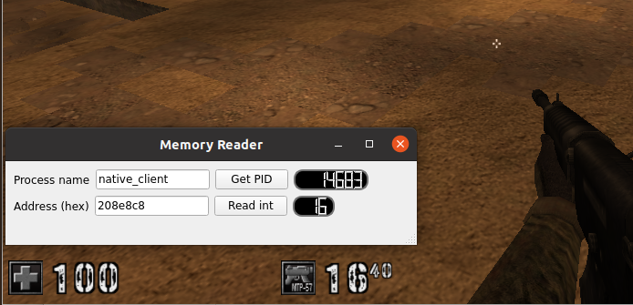

# Memory Reader
Read memory from any process by only specifying the name of the process. Works by reading through /proc/ directory. 
Functionality is collected in `ProcessManager` class and utilities are exposed through basic GUI made with Qt6



### Pipeline

- [x] get PID of process based on name
- [x] read integer from arbitrary 
- [ ] add drop down to different data types (char, short, long etc.)
- [ ] add continous monitoring of variables using QTimer
- [ ] write memory at given address

### Build instructions
in project root:
```
cmake -B build
cd build && make
```